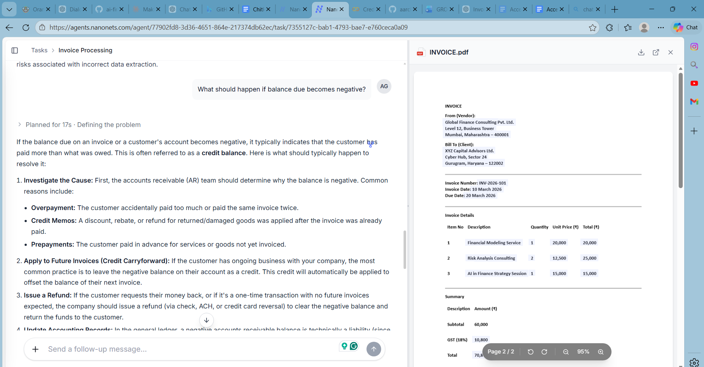
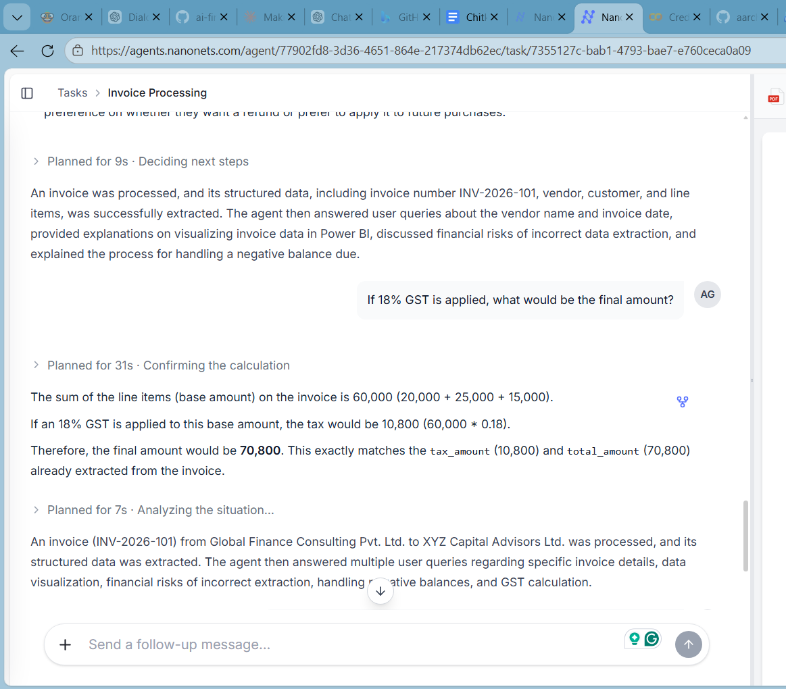
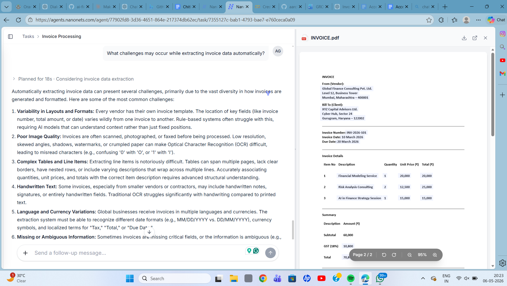
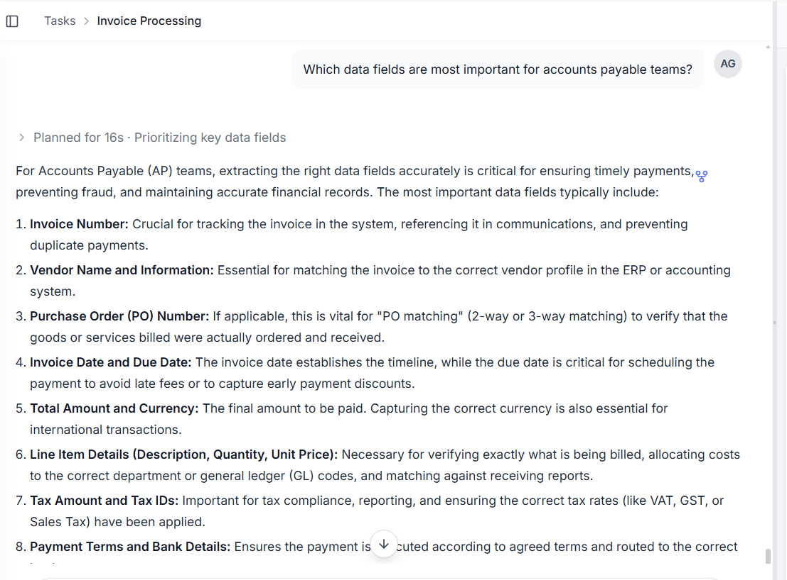
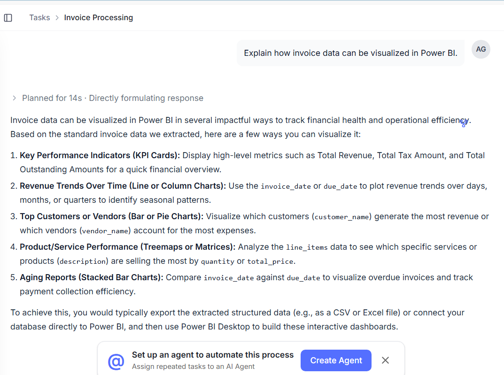

# 💳 AI Invoice Intelligence System using NanoNets + OCR + Power BI

## 📌 Project Overview

This project demonstrates an AI-powered **Invoice Processing & Financial Intelligence System** built using **NanoNets OCR, AI-based invoice extraction, automation workflows, and Power BI analytics**.

The system automatically extracts invoice data from uploaded invoices, identifies financial details, validates payment information, and generates business insights for finance teams.

It reduces manual invoice handling, improves accuracy, and enables real-time financial analytics.

---

# 🚨 Business Problem

Traditional invoice processing involves:

- Manual invoice verification
- Data entry errors
- Delayed approvals
- Duplicate invoice risks
- Time-consuming financial reconciliation

### ❌ Challenges

- Human errors in invoice entry
- Slow accounts payable process
- Difficulty tracking invoices
- Risk of fraud or duplicate invoices
- No centralized analytics

---

# ✅ Solution

This AI-powered solution automates invoice processing using OCR and analytics.

### 🔄 Workflow

1. Invoice uploaded to NanoNets
2. OCR extracts invoice fields automatically
3. AI validates invoice information
4. Financial data stored for analysis
5. Insights visualized in Power BI dashboards

---

# 🛠️ Technologies Used

- NanoNets OCR
- AI Invoice Extraction
- OCR & Document Intelligence
- Power BI
- Finance Analytics
- Automation Workflow Tools

---

# 🔍 Key AI Capabilities

- Automatic invoice number extraction
- Vendor & customer identification
- Date recognition using OCR
- Amount & tax extraction
- Banking detail detection
- Duplicate invoice detection
- AI-powered validation checks

---

# 📁 Project Structure

```text
ai-invoice-intelligence-system/
│
├── README.md
├── question_1.png
├── question_2.png
├── question_3.png
├── question_4.png
├── question_5.png
└── invoice_analysis_dashboard.pbix
```

---

# 📸 AI Invoice Analysis Screenshots

## 1️⃣ Invoice AI Question Analysis



---

## 2️⃣ OCR Data Extraction



---

## 3️⃣ Financial Intelligence Response



---

## 4️⃣ AI-Based Invoice Validation



---

## 5️⃣ Analytical & Risk Detection



---

# ⭐ Key Features

- AI-powered invoice extraction
- OCR-based financial data reading
- Automated invoice validation
- Duplicate invoice detection
- Banking detail verification
- Real-time invoice analytics
- Smart financial insights

---

# 📊 Business Impact

- Reduced manual workload
- Faster invoice processing
- Improved financial accuracy
- Better fraud detection
- Real-time finance visibility
- Enhanced operational efficiency

---

# 🔐 Risk Detection & Validation

The system can identify:

- Duplicate invoice numbers
- Incorrect calculations
- Missing invoice fields
- OCR extraction errors
- Invalid banking details
- Outstanding payment risks

---

# 📈 Power BI Analytics Use Cases

Invoice data can be visualized in Power BI for:

- Expense trends
- Vendor analysis
- Pending payments
- Tax analysis
- Department-wise expenses
- Fraud detection dashboards

---

# 🧠 AI & OCR Research Questions

This project also explores advanced AI-driven invoice intelligence questions such as:

- How OCR extracts invoice data automatically
- Challenges in invoice data extraction
- Fraud detection in finance automation
- AI validation of invoice information
- Financial analytics using extracted invoice data

---

# 🚀 Future Enhancements

- ERP integration
- Automated approval workflows
- AI fraud prediction
- Real-time finance chatbot
- Multi-language invoice support
- Cloud-based invoice processing

---

# 🏁 Conclusion

This project demonstrates how AI and OCR technologies can modernize traditional invoice management systems into intelligent financial automation platforms.

Using NanoNets OCR and analytics tools, organizations can reduce manual effort, improve accuracy, and make faster financial decisions.

---

# 👩‍💼 Author

## **AARCHIE GUPTA**

MBA Finance Student | AI in Finance Enthusiast | Financial Automation Learner
